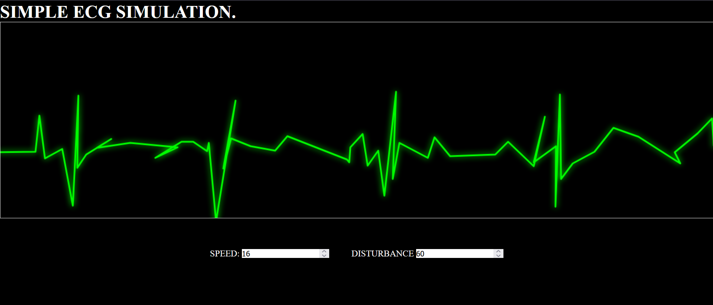
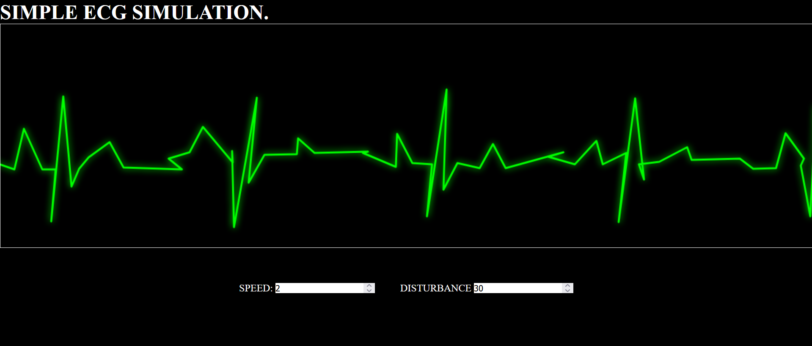
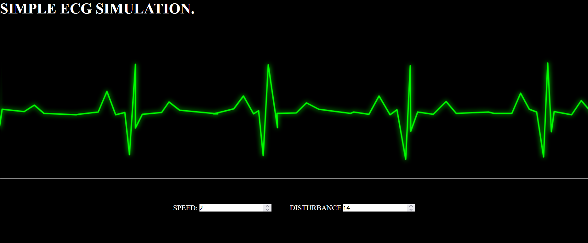
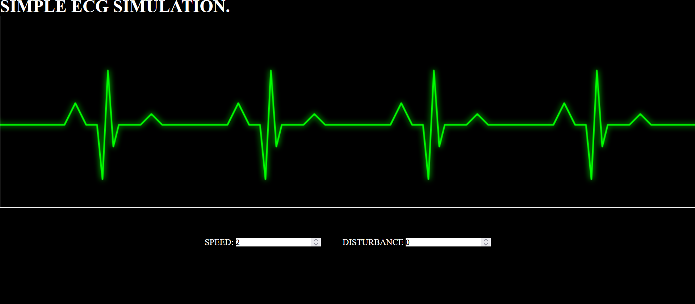

# SIMPLE-ECG-DISPLAY
This is a simple project i just made as to learn Canva Tags.
# ECG 

A simple animated ECG waveform simulation built using HTML5 Canvas and JavaScript.

## Features

- Smooth ECG wave animation
- Adjustable speed and disturbance using sliders

## 🚀 Usage Steps 

1.Clone Repository or just copy the damn Files.
2.Then just run the ECg.html file in browser (best: chrome).
3.Just play with it until you get bored.

## 📂 File Structure
ECG-DISPLAY/
│
├── index.html
├── script.js
├── README.md
└── assets

## 💡 Future Ideas

-Nope, this is just a trash project.

## Some Crazy Moments

Got stuck with Heated CPU:

Then Its is cool:

Then It is cooler:

Then it is Coolest:

